Final Project
================
Joanna Kennedy
2022-11-22

``` r
library(ggplot2)
library(stringr)
library(lubridate)
```

    ## 
    ## Attaching package: 'lubridate'

    ## The following objects are masked from 'package:base':
    ## 
    ##     date, intersect, setdiff, union

``` r
library(tidyverse)
```

    ## ── Attaching packages
    ## ───────────────────────────────────────
    ## tidyverse 1.3.2 ──

    ## ✔ tibble  3.1.8      ✔ purrr   0.3.4 
    ## ✔ tidyr   1.2.1      ✔ dplyr   1.0.10
    ## ✔ readr   2.1.3      ✔ forcats 0.5.2 
    ## ── Conflicts ────────────────────────────────────────── tidyverse_conflicts() ──
    ## ✖ lubridate::as.difftime() masks base::as.difftime()
    ## ✖ lubridate::date()        masks base::date()
    ## ✖ dplyr::filter()          masks stats::filter()
    ## ✖ lubridate::intersect()   masks base::intersect()
    ## ✖ dplyr::lag()             masks stats::lag()
    ## ✖ lubridate::setdiff()     masks base::setdiff()
    ## ✖ lubridate::union()       masks base::union()

``` r
library(ggrepel)
library(caret)
```

    ## Warning: package 'caret' was built under R version 4.2.2

    ## Loading required package: lattice
    ## 
    ## Attaching package: 'caret'
    ## 
    ## The following object is masked from 'package:purrr':
    ## 
    ##     lift

``` r
library(MLmetrics)
```

    ## Warning: package 'MLmetrics' was built under R version 4.2.2

    ## 
    ## Attaching package: 'MLmetrics'
    ## 
    ## The following objects are masked from 'package:caret':
    ## 
    ##     MAE, RMSE
    ## 
    ## The following object is masked from 'package:base':
    ## 
    ##     Recall

``` r
library(stats)
library(dplyr)
library(glmnet)
```

    ## Warning: package 'glmnet' was built under R version 4.2.2

    ## Loading required package: Matrix

    ## Warning: package 'Matrix' was built under R version 4.2.2

    ## 
    ## Attaching package: 'Matrix'
    ## 
    ## The following objects are masked from 'package:tidyr':
    ## 
    ##     expand, pack, unpack
    ## 
    ## Loaded glmnet 4.1-6

``` r
setwd("C:/Users/jjken/Desktop/Harvard/Fall 2022/BST 260/finalprojectwebsite")
df = read.csv(file = 'Student Mental health.csv')
```

Cleaning

``` r
head(df)
```

    ##        Timestamp Choose.your.gender Age What.is.your.course.
    ## 1 8/7/2020 12:02             Female  18          Engineering
    ## 2 8/7/2020 12:04               Male  21    Islamic education
    ## 3 8/7/2020 12:05               Male  19                  BIT
    ## 4 8/7/2020 12:06             Female  22                 Laws
    ## 5 8/7/2020 12:13               Male  23         Mathemathics
    ## 6 8/7/2020 12:31               Male  19          Engineering
    ##   Your.current.year.of.Study What.is.your.CGPA. Marital.status
    ## 1                     year 1        3.00 - 3.49             No
    ## 2                     year 2        3.00 - 3.49             No
    ## 3                     Year 1        3.00 - 3.49             No
    ## 4                     year 3        3.00 - 3.49            Yes
    ## 5                     year 4        3.00 - 3.49             No
    ## 6                     Year 2        3.50 - 4.00             No
    ##   Do.you.have.Depression. Do.you.have.Anxiety. Do.you.have.Panic.attack.
    ## 1                     Yes                   No                       Yes
    ## 2                      No                  Yes                        No
    ## 3                     Yes                  Yes                       Yes
    ## 4                     Yes                   No                        No
    ## 5                      No                   No                        No
    ## 6                      No                   No                       Yes
    ##   Did.you.seek.any.specialist.for.a.treatment.
    ## 1                                           No
    ## 2                                           No
    ## 3                                           No
    ## 4                                           No
    ## 5                                           No
    ## 6                                           No

``` r
apply(df, 2, unique)
```

    ## $Timestamp
    ##  [1] "8/7/2020 12:02"      "8/7/2020 12:04"      "8/7/2020 12:05"     
    ##  [4] "8/7/2020 12:06"      "8/7/2020 12:13"      "8/7/2020 12:31"     
    ##  [7] "8/7/2020 12:32"      "8/7/2020 12:33"      "8/7/2020 12:35"     
    ## [10] "8/7/2020 12:39"      "8/7/2020 12:40"      "8/7/2020 12:41"     
    ## [13] "8/7/2020 12:43"      "8/7/2020 12:46"      "8/7/2020 12:52"     
    ## [16] "8/7/2020 13:05"      "8/7/2020 13:07"      "8/7/2020 13:12"     
    ## [19] "8/7/2020 13:13"      "8/7/2020 13:15"      "8/7/2020 13:17"     
    ## [22] "8/7/2020 13:29"      "8/7/2020 13:35"      "8/7/2020 13:41"     
    ## [25] "8/7/2020 13:58"      "8/7/2020 14:05"      "8/7/2020 14:27"     
    ## [28] "8/7/2020 14:29"      "8/7/2020 14:31"      "8/7/2020 14:41"     
    ## [31] "8/7/2020 14:43"      "8/7/2020 14:45"      "8/7/2020 14:47"     
    ## [34] "8/7/2020 14:56"      "8/7/2020 14:57"      "8/7/2020 14:58"     
    ## [37] "8/7/2020 15:07"      "8/7/2020 15:08"      "8/7/2020 15:09"     
    ## [40] "8/7/2020 15:12"      "8/7/2020 15:14"      "8/7/2020 15:18"     
    ## [43] "8/7/2020 15:27"      "8/7/2020 15:37"      "8/7/2020 15:47"     
    ## [46] "8/7/2020 15:48"      "8/7/2020 15:57"      "8/7/2020 15:58"     
    ## [49] "8/7/2020 16:08"      "8/7/2020 16:21"      "8/7/2020 16:22"     
    ## [52] "8/7/2020 16:34"      "8/7/2020 16:53"      "8/7/2020 17:05"     
    ## [55] "8/7/2020 17:37"      "8/7/2020 17:46"      "8/7/2020 17:50"     
    ## [58] "8/7/2020 18:10"      "8/7/2020 18:11"      "8/7/2020 19:05"     
    ## [61] "8/7/2020 19:32"      "8/7/2020 20:36"      "8/7/2020 21:21"     
    ## [64] "8/7/2020 22:35"      "9/7/2020 6:57"       "9/7/2020 11:43"     
    ## [67] "9/7/2020 11:57"      "9/7/2020 13:15"      "9/7/2020 18:24"     
    ## [70] "13/07/2020 10:07:32" "13/07/2020 10:10:30" "13/07/2020 10:11:26"
    ## [73] "13/07/2020 10:12:18" "13/07/2020 10:12:26" "13/07/2020 10:12:28"
    ## [76] "13/07/2020 10:14:46" "13/07/2020 10:33:47" "13/07/2020 10:34:08"
    ## [79] "13/07/2020 11:46:13" "13/07/2020 11:49:02" "13/07/2020 11:54:58"
    ## [82] "13/07/2020 13:57:11" "13/07/2020 14:38:12" "13/07/2020 14:48:05"
    ## [85] "13/07/2020 16:15:13" "13/07/2020 17:30:44" "13/07/2020 19:08:32"
    ## [88] "13/07/2020 19:56:49" "13/07/2020 21:21:42" "13/07/2020 21:22:56"
    ## [91] "13/07/2020 21:23:57" "18/07/2020 20:16:21"
    ## 
    ## $Choose.your.gender
    ## [1] "Female" "Male"  
    ## 
    ## $Age
    ## [1] "18" "21" "19" "22" "23" "20" "24" NA  
    ## 
    ## $What.is.your.course.
    ##  [1] "Engineering"             "Islamic education"      
    ##  [3] "BIT"                     "Laws"                   
    ##  [5] "Mathemathics"            "Pendidikan islam"       
    ##  [7] "BCS"                     "Human Resources"        
    ##  [9] "Irkhs"                   "Psychology"             
    ## [11] "KENMS"                   "Accounting "            
    ## [13] "ENM"                     "Marine science"         
    ## [15] "KOE"                     "Banking Studies"        
    ## [17] "Business Administration" "Law"                    
    ## [19] "KIRKHS"                  "Usuluddin "             
    ## [21] "TAASL"                   "Engine"                 
    ## [23] "ALA"                     "Biomedical science"     
    ## [25] "koe"                     "Kirkhs"                 
    ## [27] "BENL"                    "Benl"                   
    ## [29] "IT"                      "CTS"                    
    ## [31] "engin"                   "Econs"                  
    ## [33] "MHSC"                    "Malcom"                 
    ## [35] "Kop"                     "Human Sciences "        
    ## [37] "Biotechnology"           "Communication "         
    ## [39] "Diploma Nursing"         "Pendidikan Islam "      
    ## [41] "Radiography"             "psychology"             
    ## [43] "Fiqh fatwa "             "DIPLOMA TESL"           
    ## [45] "Koe"                     "Fiqh"                   
    ## [47] "Islamic Education"       "Nursing "               
    ## [49] "Pendidikan Islam"       
    ## 
    ## $Your.current.year.of.Study
    ## [1] "year 1" "year 2" "Year 1" "year 3" "year 4" "Year 2" "Year 3"
    ## 
    ## $What.is.your.CGPA.
    ## [1] "3.00 - 3.49"  "3.50 - 4.00"  "3.50 - 4.00 " "2.50 - 2.99"  "2.00 - 2.49" 
    ## [6] "0 - 1.99"    
    ## 
    ## $Marital.status
    ## [1] "No"  "Yes"
    ## 
    ## $Do.you.have.Depression.
    ## [1] "Yes" "No" 
    ## 
    ## $Do.you.have.Anxiety.
    ## [1] "No"  "Yes"
    ## 
    ## $Do.you.have.Panic.attack.
    ## [1] "Yes" "No" 
    ## 
    ## $Did.you.seek.any.specialist.for.a.treatment.
    ## [1] "No"  "Yes"

``` r
for (i in 1:ncol(df)){
  
  temp <- as.data.frame(df[,i])
  nm <- colnames(df)[i]
  colnames(temp) <- "response"
  
  counts <- temp %>% group_by(response) %>% dplyr::summarise(count = n())
  
  plot<- ggplot(data=counts, aes(x=response, y=count, fill=response)) +
    geom_bar(stat="identity") +
    geom_text(aes(label=count)) +
    theme(axis.text.x = element_text(size = 6, angle = 90)) +
    ggtitle(nm)
  print(plot)
  
}
```

<!-- --><!-- -->

    ## Warning: Removed 1 rows containing missing values (position_stack).

    ## Warning: Removed 1 rows containing missing values (geom_text).

<!-- --><!-- --><!-- --><!-- --><!-- --><!-- --><!-- --><!-- -->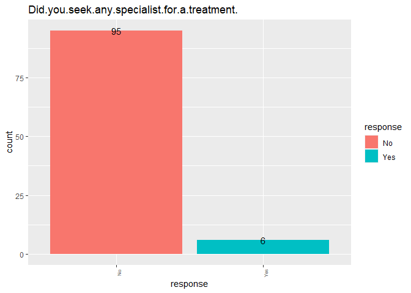<!-- -->

``` r
colnames(df) = c("day","gender","age", "course","grade","gpa","married", "depression","anxiety","panic_attack", "treatment")
```

``` r
sapply(df, function(x) sum(is.na(x)))
```

    ##          day       gender          age       course        grade          gpa 
    ##            0            0            1            0            0            0 
    ##      married   depression      anxiety panic_attack    treatment 
    ##            0            0            0            0            0

``` r
df <- df %>% filter(!is.na(df$age))
```

``` r
df <- as.data.frame(apply(df, 2, tolower))
```

year and month are the same so just day and time are different

``` r
df <- separate(df, col=day, into=c("day", "time"), sep = " ")
df <- separate(df, col=day, into=c("day", "rest"), sep = "/")
```

    ## Warning: Expected 2 pieces. Additional pieces discarded in 100 rows [1, 2, 3, 4,
    ## 5, 6, 7, 8, 9, 10, 11, 12, 13, 14, 15, 16, 17, 18, 19, 20, ...].

``` r
df$rest <- NULL
df <- separate(df, col=time, into=c("hour", "minute"), sep = ":")
```

    ## Warning: Expected 2 pieces. Additional pieces discarded in 23 rows [78, 79, 80,
    ## 81, 82, 83, 84, 85, 86, 87, 88, 89, 90, 91, 92, 93, 94, 95, 96, 97, ...].

round hour and get rid of minute

``` r
df$hour <- as.numeric(df$hour)
df$minute <- as.numeric(df$minute)
df$round <- 0
df[which(df$minute >29), 'round'] <- 1
df$hour <- df$hour + df$round
df$round <- NULL
df$minute <- NULL
```

``` r
df$course <- sapply(df$course, str_trim)
df$course <- df$course %>% str_replace("^engin.*","engineering") %>% str_replace("^fiqh.*","fiqh") %>% str_replace("^law.*", "laws") %>% str_replace(".*irkhs$", "kirkhs") %>% str_replace(".*nursing$", "nursing")
df %>% arrange(course) %>% group_by(course) %>% dplyr::summarise(count = n()) %>% arrange(-count)
```

    ## # A tibble: 35 × 2
    ##    course             count
    ##    <chr>              <int>
    ##  1 engineering           20
    ##  2 bcs                   18
    ##  3 bit                    9
    ##  4 koe                    6
    ##  5 biomedical science     4
    ##  6 benl                   3
    ##  7 kirkhs                 3
    ##  8 laws                   3
    ##  9 pendidikan islam       3
    ## 10 psychology             3
    ## # … with 25 more rows

``` r
df$grade <- df$grade %>% str_replace("year 1","9") %>% str_replace("year 2","10") %>% str_replace("year 3", "11") %>% str_replace("year 4", "12")
```

``` r
df$gpa <- sapply(df$gpa, str_trim)
df <- separate(df, col=gpa, into=c("low", "gpa"), sep = " - ")
df$low <- NULL
```

``` r
for (i in 1:ncol(df)){
  
  temp <- as.data.frame(df[,i])
  nm <- colnames(df)[i]
  colnames(temp) <- "response"
  
  counts <- as.data.frame(temp) %>% group_by(response) %>% dplyr::summarise(count = n())
  
  plot<- ggplot(data=counts, aes(x=response, y=count, fill=response)) +
    geom_bar(stat="identity") +
    geom_text(aes(label=count)) +
    theme(axis.text.x = element_text(size = 6, angle = 90)) +
    ggtitle(nm)
  print(plot)
  
}
```

<!-- --><!-- --><!-- --><!-- --><!-- --><!-- --><!-- --><!-- --><!-- --><!-- --><!-- --><!-- -->

``` r
#ggplot(age_counts_mental_health, aes(x=mental_health, y=count)) +
#  geom_point() +
```

``` r
df[,c(1,2,4,6,7)]<-as.data.frame(apply(df[,c(1,2,4,6,7)], 2, as.numeric))
numerical <- df[,c(1,2,4,6,7)]
numerical_colnames <- c("day","hour", "age","grade","gpa")
categorical <- df[,c(5)]
categorical_colnames <- c("course")
binary <- df[,c(3,8:12)]
binary_colnames <- c("gender", "married", "depression", "anxiety", "panic_attack", "treatment") #"engineering", "bcs")
```

``` r
#apply(numerical,2,class)
#apply(numerical,2,hist)
```

``` r
numerical
```

    ##     day hour age grade  gpa
    ## 1     8   12  18     9 3.49
    ## 2     8   12  21    10 3.49
    ## 3     8   12  19     9 3.49
    ## 4     8   12  22    11 3.49
    ## 5     8   12  23    12 3.49
    ## 6     8   13  19    10 4.00
    ## 7     8   13  23    10 4.00
    ## 8     8   13  18     9 4.00
    ## 9     8   13  19    10 2.99
    ## 10    8   13  18     9 4.00
    ## 11    8   13  20     9 4.00
    ## 12    8   13  24    11 4.00
    ## 13    8   13  18     9 3.49
    ## 14    8   13  19     9 3.49
    ## 15    8   13  18    10 4.00
    ## 16    8   13  24    11 4.00
    ## 17    8   13  24    11 3.49
    ## 18    8   13  24    12 3.49
    ## 19    8   13  20    10 4.00
    ## 20    8   13  18    10 4.00
    ## 21    8   13  19     9 3.49
    ## 22    8   13  18    10 3.49
    ## 23    8   13  24     9 4.00
    ## 24    8   13  24     9 3.49
    ## 25    8   13  23    11 4.00
    ## 26    8   13  18     9 4.00
    ## 27    8   14  19     9 4.00
    ## 28    8   14  18    10 3.49
    ## 29    8   14  24    11 4.00
    ## 30    8   14  24    12 4.00
    ## 31    8   14  23    10 3.49
    ## 32    8   14  18    10 3.49
    ## 33    8   14  19     9 4.00
    ## 34    8   15  18    10 4.00
    ## 35    8   15  19     9 3.49
    ## 36    8   15  18     9 2.49
    ## 37    8   15  18    11 3.49
    ## 38    8   15  19     9 2.99
    ## 39    8   15  18     9 4.00
    ## 40    8   15  24    10 2.99
    ## 41    8   15  24    11 3.49
    ## 42    8   15  22    12 4.00
    ## 43    8   15  20    10 3.49
    ## 44    8   15  23    10 4.00
    ## 45    8   15  18     9 4.00
    ## 46    8   15  19     9 4.00
    ## 47    8   15  18    12 4.00
    ## 48    8   15  24    10 3.49
    ## 49    8   15  24    11 4.00
    ## 50    8   15  23     9 2.99
    ## 51    8   16  18    10 4.00
    ## 52    8   16  19    11 3.49
    ## 53    8   16  20    11 3.49
    ## 54    8   16  19     9 4.00
    ## 55    8   16  21     9 3.49
    ## 56    8   16  23    11 4.00
    ## 57    8   16  20    11 3.49
    ## 58    8   16  18     9 4.00
    ## 59    8   17  23     9 3.49
    ## 60    8   17  18    11 3.49
    ## 61    8   17  19     9 4.00
    ## 62    8   17  18     9 4.00
    ## 63    8   18  24     9 4.00
    ## 64    8   18  24     9 4.00
    ## 65    8   18  23     9 4.00
    ## 66    8   18  18    11 3.49
    ## 67    8   18  19    11 3.49
    ## 68    8   19  18     9 4.00
    ## 69    8   20  24    12 3.49
    ## 70    8   21  24     9 3.49
    ## 71    8   21  18    11 4.00
    ## 72    8   23  19    11 3.49
    ## 73    9    7  18     9 1.99
    ## 74    9   12  24    11 4.00
    ## 75    9   12  24     9 4.00
    ## 76    9   13  23     9 3.49
    ## 77    9   18  18    10 3.49
    ## 78   13   10  19    11 1.99
    ## 79   13   10  18    12 4.00
    ## 80   13   10  24    10 4.00
    ## 81   13   10  24    10 4.00
    ## 82   13   10  19     9 3.49
    ## 83   13   10  19    10 3.49
    ## 84   13   10  23     9 3.49
    ## 85   13   11  18     9 4.00
    ## 86   13   11  19    11 3.49
    ## 87   13   12  18     9 4.00
    ## 88   13   12  24     9 3.49
    ## 89   13   12  24    10 2.49
    ## 90   13   14  23    11 4.00
    ## 91   13   15  18    10 3.49
    ## 92   13   15  19    10 3.49
    ## 93   13   16  18     9 3.49
    ## 94   13   18  24    11 1.99
    ## 95   13   19  18     9 4.00
    ## 96   13   20  21     9 4.00
    ## 97   13   21  18    10 3.49
    ## 98   13   21  19    11 4.00
    ## 99   13   21  23    12 4.00
    ## 100  18   20  20    10 3.49

``` r
plot(cbind(numerical,binary))
```

<!-- -->

``` r
plot(numerical)
```

<!-- -->

``` r
test <- df %>% group_by(grade,course) %>% dplyr::summarise(group_gpa=mean(gpa), count = n()) %>% filter(count>2)
```

    ## `summarise()` has grouped output by 'grade'. You can override using the
    ## `.groups` argument.

``` r
ggplot(test, aes(x=grade,y=group_gpa, color=course)) +
  geom_line() +
  geom_point()
```

<!-- -->

``` r
test <- df %>% group_by(grade,course) %>% dplyr::summarise(average_gpa=mean(gpa), count = n()) %>% filter(count>2)
```

    ## `summarise()` has grouped output by 'grade'. You can override using the
    ## `.groups` argument.

``` r
ggplot(test, aes(grade, average_gpa)) + 
  ggtitle("Trends in GPA by Course") +
  geom_jitter(aes(col=course)) + 
  geom_smooth(aes(col=course), method="lm", se=F)
```

    ## `geom_smooth()` using formula 'y ~ x'

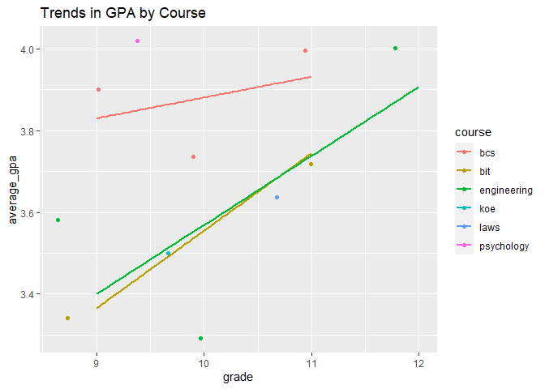<!-- -->

``` r
explore <- df

label_mental_health <- function(df,last_column){
  df$mental_health <- ""
  for (participant in 1:nrow(df)){
    for (condition in 9:last_column){
      if (df[participant,][condition] == "yes"){
        df[participant,][last_column+1] <- paste(df[participant,][last_column+1],colnames(df[condition]))
      }
    }
  }
  df$mental_health <- sapply(df$mental_health, str_squish)
  return (df)
}

explore <- label_mental_health(explore, dim(explore)[2])
```

``` r
explore %>% group_by(mental_health) %>% dplyr::summarise(count = n())
```

    ## # A tibble: 11 × 2
    ##    mental_health                               count
    ##    <chr>                                       <int>
    ##  1 ""                                             36
    ##  2 "anxiety"                                      13
    ##  3 "anxiety panic_attack"                          3
    ##  4 "depression"                                   10
    ##  5 "depression anxiety"                            6
    ##  6 "depression anxiety panic_attack"               9
    ##  7 "depression anxiety panic_attack treatment"     1
    ##  8 "depression anxiety treatment"                  2
    ##  9 "depression panic_attack"                       4
    ## 10 "depression panic_attack treatment"             3
    ## 11 "panic_attack"                                 13

``` r
for(i in 1:(ncol(numerical))){
  
  temp <- as.data.frame(numerical[,i])
  nm <- colnames(numerical)[i]
  colnames(temp) <- "response"
  
  temp$mental_health <- explore$mental_health
  
  counts <- as.data.frame(temp) %>% group_by(response,mental_health) %>% dplyr::summarise(count = n())
  
  plot<- ggplot(data=counts, aes(x=response, y=count, fill=response)) +
    geom_bar(stat="identity") +
    geom_text(aes(label=count)) +
    facet_wrap(~mental_health, ncol=3) +
    theme(axis.text.x = element_text(size = 6, angle = 90)) +
    ggtitle(nm)
  print(plot)
  
}
```

    ## `summarise()` has grouped output by 'response'. You can override using the
    ## `.groups` argument.
    ## `summarise()` has grouped output by 'response'. You can override using the
    ## `.groups` argument.

<!-- -->

    ## `summarise()` has grouped output by 'response'. You can override using the
    ## `.groups` argument.

<!-- -->

    ## `summarise()` has grouped output by 'response'. You can override using the
    ## `.groups` argument.

<!-- -->

    ## `summarise()` has grouped output by 'response'. You can override using the
    ## `.groups` argument.

<!-- --><!-- -->

Chi Squared Test

``` r
two_by_two <- data.frame(
  depression = c("no", "yes"), 
  men = 
    c(sum(df$gender == "male" & df$depression == "no"), 
      sum(df$gender == "male" & df$depression == "yes")), 
  women = 
    c(sum(df$gender == "female" & df$depression == "no"), 
      sum(df$gender == "female" & df$depression == "yes")))

two_by_two
```

    ##   depression men women
    ## 1         no  19    46
    ## 2        yes   6    29

``` r
chisq_test <- two_by_two |> select(-depression) |> chisq.test()
chisq_test
```

    ## 
    ##  Pearson's Chi-squared test with Yates' continuity correction
    ## 
    ## data:  select(two_by_two, -depression)
    ## X-squared = 1.1868, df = 1, p-value = 0.276

``` r
association <- c()
all <- c()
pvs <- c()
for(i in 1:(ncol(binary)-1)){
  for(j in (i+1):(ncol(binary))){
    if (i != j){
      test <- chisq.test(df[,i], df[,j])
      compare <- paste(binary_colnames[i], binary_colnames[j], sep = " vs. ")
      all <- c(all,compare)
      pvs <- c(pvs,test$p.value)
      if (test$p.value < 0.05) {
        association <- c(association, compare)
      }
    }
    
  }
}
```

    ## Warning in chisq.test(df[, i], df[, j]): Chi-squared approximation may be
    ## incorrect

    ## Warning in chisq.test(df[, i], df[, j]): Chi-squared approximation may be
    ## incorrect

    ## Warning in chisq.test(df[, i], df[, j]): Chi-squared approximation may be
    ## incorrect

    ## Warning in chisq.test(df[, i], df[, j]): Chi-squared approximation may be
    ## incorrect

    ## Warning in chisq.test(df[, i], df[, j]): Chi-squared approximation may be
    ## incorrect

    ## Warning in chisq.test(df[, i], df[, j]): Chi-squared approximation may be
    ## incorrect

    ## Warning in chisq.test(df[, i], df[, j]): Chi-squared approximation may be
    ## incorrect

    ## Warning in chisq.test(df[, i], df[, j]): Chi-squared approximation may be
    ## incorrect

    ## Warning in chisq.test(df[, i], df[, j]): Chi-squared approximation may be
    ## incorrect

    ## Warning in chisq.test(df[, i], df[, j]): Chi-squared approximation may be
    ## incorrect

    ## Warning in chisq.test(df[, i], df[, j]): Chi-squared approximation may be
    ## incorrect

    ## Warning in chisq.test(df[, i], df[, j]): Chi-squared approximation may be
    ## incorrect

    ## Warning in chisq.test(df[, i], df[, j]): Chi-squared approximation may be
    ## incorrect

    ## Warning in chisq.test(df[, i], df[, j]): Chi-squared approximation may be
    ## incorrect

    ## Warning in chisq.test(df[, i], df[, j]): Chi-squared approximation may be
    ## incorrect

``` r
chi_square_table <- data.frame(unlist(all),unlist(pvs))
```

``` r
association
```

    ## [1] "gender vs. married"         "panic_attack vs. treatment"

``` r
colnames(chi_square_table) <- c("Comparison","P Value")
chi_square_table
```

    ##                     Comparison      P Value
    ## 1           gender vs. married 1.195221e-08
    ## 2        gender vs. depression 2.915759e-01
    ## 3           gender vs. anxiety 2.840283e-01
    ## 4      gender vs. panic_attack 5.198498e-01
    ## 5         gender vs. treatment 8.792311e-01
    ## 6       married vs. depression 3.177692e-01
    ## 7          married vs. anxiety 9.635715e-01
    ## 8     married vs. panic_attack 6.203333e-02
    ## 9        married vs. treatment 9.216927e-01
    ## 10      depression vs. anxiety 6.707566e-01
    ## 11 depression vs. panic_attack 6.390291e-01
    ## 12    depression vs. treatment 1.118481e-01
    ## 13    anxiety vs. panic_attack 6.878439e-01
    ## 14       anxiety vs. treatment 3.356754e-01
    ## 15  panic_attack vs. treatment 4.877638e-02

Shapiro Wilk’s Test

``` r
all <- c()
normal <- c()
non_normal_numerical = c()
for (i in 1:ncol(numerical)){
  test <- shapiro.test(numerical[,i])
  print(test)
  all <- c(all,numerical_colnames[i])
  if (test$p.value < 0.05){
    non_normal_numerical <- c(non_normal_numerical, numerical_colnames[i])
    normal <- c(normal,FALSE)
  }
  normal <- c(normal,TRUE)
}
```

    ## 
    ##  Shapiro-Wilk normality test
    ## 
    ## data:  numerical[, i]
    ## W = 0.57082, p-value = 1.241e-15
    ## 
    ## 
    ##  Shapiro-Wilk normality test
    ## 
    ## data:  numerical[, i]
    ## W = 0.9583, p-value = 0.003049
    ## 
    ## 
    ##  Shapiro-Wilk normality test
    ## 
    ## data:  numerical[, i]
    ## W = 0.78617, p-value = 9.519e-11
    ## 
    ## 
    ##  Shapiro-Wilk normality test
    ## 
    ## data:  numerical[, i]
    ## W = 0.82161, p-value = 1.209e-09
    ## 
    ## 
    ##  Shapiro-Wilk normality test
    ## 
    ## data:  numerical[, i]
    ## W = 0.69687, p-value = 4.562e-13

``` r
shap_table <- data.frame(unlist(all),unlist(normal))
colnames(shap_table) <- c("Variable","Normal")
shap_table
```

    ##    Variable Normal
    ## 1       day  FALSE
    ## 2      hour   TRUE
    ## 3       age  FALSE
    ## 4     grade   TRUE
    ## 5       gpa  FALSE
    ## 6       day   TRUE
    ## 7      hour  FALSE
    ## 8       age   TRUE
    ## 9     grade  FALSE
    ## 10      gpa   TRUE

``` r
non_normal_numerical
```

    ## [1] "day"   "hour"  "age"   "grade" "gpa"

Regression

``` r
for(i in 1:(ncol(numerical)-1)) {
  for(j in (i+1):ncol(numerical)){
    for(k in binary_colnames){
      plot <- ggplot(df,aes(x=df[,numerical_colnames[i]], y=df[,numerical_colnames[j]], color=df[,k], group = df[,k])) +
        #geom_boxplot() +
        geom_point(position=position_jitter(h=0.07,w=0.07)) +
        ylab(numerical_colnames[j]) +
        xlab(numerical_colnames[i]) +
        labs(color = k)
      print(plot)
    }
  }
}
```

<!-- --><!-- --><!-- --><!-- --><!-- --><!-- --><!-- --><!-- --><!-- --><!-- --><!-- --><!-- --><!-- --><!-- -->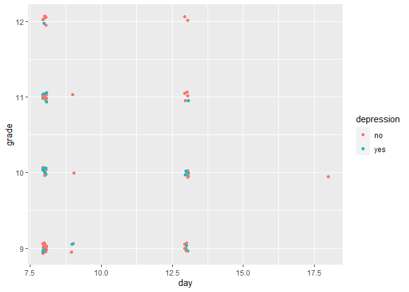<!-- --><!-- --><!-- --><!-- --><!-- --><!-- -->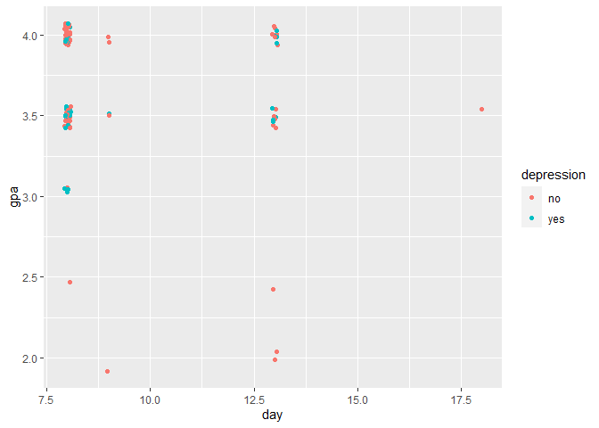<!-- --><!-- --><!-- --><!-- --><!-- --><!-- --><!-- --><!-- --><!-- --><!-- --><!-- --><!-- --><!-- --><!-- --><!-- --><!-- --><!-- --><!-- --><!-- --><!-- --><!-- --><!-- --><!-- --><!-- --><!-- --><!-- --><!-- --><!-- --><!-- -->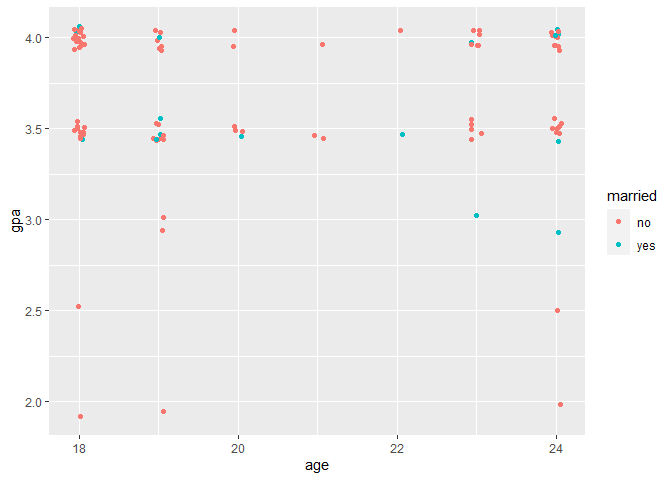<!-- --><!-- --><!-- --><!-- --><!-- --><!-- --><!-- --><!-- --><!-- --><!-- --><!-- -->

I acknowledge gender as a categorical value rather than a binary value,
but within the context of this datasets, students were categorized as
either female or male.

``` r
#c("gender", "married", "depression", "anxiety", "panic_attack", "treatment", "engineering")

traini <- sample(nrow(df), round(0.8*nrow(df)))
testi <- c(1:nrow(df))[-traini]
train <- df[traini, ]
test <- df[testi, ]


train$gender <- ifelse(train$gender == 'female',1,0)
train$married <- ifelse(train$married == 'yes',1,0)
train$depression <- ifelse(train$depression == 'yes',1,0)
train$anxiety <- ifelse(train$anxiety == 'yes',1,0)
train$panic_attack <- ifelse(train$panic_attack == 'yes',1,0)
train$treatment <- ifelse(train$treatment == 'yes',1,0)
train$engineering <- ifelse(train$course == 'engineering',1,0)
train$bcs <- ifelse(train$course == 'bcs',1,0)

test$gender <- ifelse(test$gender == 'female',1,0)
test$married <- ifelse(test$married == 'yes',1,0)
test$depression <- ifelse(test$depression == 'yes',1,0)
test$anxiety <- ifelse(test$anxiety == 'yes',1,0)
test$panic_attack <- ifelse(test$panic_attack == 'yes',1,0)
test$treatment <- ifelse(test$treatment == 'yes',1,0)
test$engineering <- ifelse(test$course == 'engineering',1,0)
test$bcs <- ifelse(test$course == 'bcs',1,0)

train <- train[,-5]
test <- test[,-5]

train <- train[,c(1,2,4:6,3,7:ncol(train))]
test <- test[,c(1,2,4:6,3,7:ncol(test))]

train
```

    ##     day hour age grade  gpa gender married depression anxiety panic_attack
    ## 10    8   13  18     9 4.00      0       0          0       1            1
    ## 31    8   14  23    10 3.49      1       0          0       0            0
    ## 66    8   18  18    11 3.49      1       0          0       1            0
    ## 70    8   21  24     9 3.49      1       0          0       0            0
    ## 12    8   13  24    11 4.00      1       1          1       0            0
    ## 87   13   12  18     9 4.00      1       0          1       1            1
    ## 13    8   13  18     9 3.49      1       0          1       0            0
    ## 74    9   12  24    11 4.00      0       0          0       1            0
    ## 82   13   10  19     9 3.49      1       0          1       1            0
    ## 56    8   16  23    11 4.00      0       0          0       0            0
    ## 99   13   21  23    12 4.00      1       0          0       0            0
    ## 21    8   13  19     9 3.49      1       0          0       0            1
    ## 40    8   15  24    10 2.99      1       1          1       0            1
    ## 14    8   13  19     9 3.49      0       0          0       0            0
    ## 64    8   18  24     9 4.00      1       0          0       0            0
    ## 49    8   15  24    11 4.00      1       0          0       0            1
    ## 4     8   12  22    11 3.49      1       1          1       0            0
    ## 79   13   10  18    12 4.00      1       0          0       0            0
    ## 54    8   16  19     9 4.00      1       0          1       0            1
    ## 42    8   15  22    12 4.00      1       0          0       0            0
    ## 100  18   20  20    10 3.49      0       0          0       0            0
    ## 95   13   19  18     9 4.00      1       0          0       0            0
    ## 39    8   15  18     9 4.00      1       0          0       0            0
    ## 37    8   15  18    11 3.49      1       0          1       1            0
    ## 34    8   15  18    10 4.00      0       1          1       1            0
    ## 52    8   16  19    11 3.49      1       0          0       0            0
    ## 28    8   14  18    10 3.49      0       1          1       1            0
    ## 29    8   14  24    11 4.00      1       1          1       1            1
    ## 51    8   16  18    10 4.00      1       0          0       1            0
    ## 73    9    7  18     9 1.99      0       0          0       0            0
    ## 76    9   13  23     9 3.49      1       0          1       0            0
    ## 77    9   18  18    10 3.49      1       0          0       0            1
    ## 68    8   19  18     9 4.00      1       0          1       0            0
    ## 23    8   13  24     9 4.00      1       0          0       0            0
    ## 90   13   14  23    11 4.00      1       0          0       0            1
    ## 43    8   15  20    10 3.49      1       0          1       0            0
    ## 47    8   15  18    12 4.00      1       0          0       0            0
    ## 19    8   13  20    10 4.00      1       0          0       1            0
    ## 20    8   13  18    10 4.00      1       1          1       1            1
    ## 30    8   14  24    12 4.00      1       0          0       0            0
    ## 83   13   10  19    10 3.49      1       0          0       0            0
    ## 2     8   12  21    10 3.49      0       0          0       1            0
    ## 22    8   13  18    10 3.49      1       0          0       0            0
    ## 84   13   10  23     9 3.49      0       0          0       0            0
    ## 16    8   13  24    11 4.00      0       0          0       0            0
    ## 69    8   20  24    12 3.49      1       0          0       1            0
    ## 75    9   12  24     9 4.00      1       0          0       1            1
    ## 38    8   15  19     9 2.99      1       0          1       1            1
    ## 93   13   16  18     9 3.49      1       0          1       0            0
    ## 15    8   13  18    10 4.00      1       0          0       1            0
    ## 3     8   12  19     9 3.49      0       0          1       1            1
    ## 18    8   13  24    12 3.49      1       1          1       1            1
    ## 46    8   15  19     9 4.00      1       0          0       1            0
    ## 36    8   15  18     9 2.49      1       0          0       0            0
    ## 50    8   15  23     9 2.99      1       1          1       0            1
    ## 65    8   18  23     9 4.00      1       0          1       1            0
    ## 58    8   16  18     9 4.00      1       0          0       0            0
    ## 57    8   16  20    11 3.49      1       0          1       1            0
    ## 48    8   15  24    10 3.49      0       0          1       0            0
    ## 88   13   12  24     9 3.49      0       0          0       1            0
    ## 5     8   12  23    12 3.49      0       0          0       0            0
    ## 62    8   17  18     9 4.00      1       0          0       0            1
    ## 85   13   11  18     9 4.00      1       0          1       1            0
    ## 26    8   13  18     9 4.00      1       0          0       0            0
    ## 17    8   13  24    11 3.49      1       0          0       0            0
    ## 71    8   21  18    11 4.00      1       0          0       0            1
    ## 59    8   17  23     9 3.49      1       0          0       0            0
    ## 6     8   13  19    10 4.00      0       0          0       0            1
    ## 9     8   13  19    10 2.99      1       0          0       0            0
    ## 80   13   10  24    10 4.00      1       1          1       1            1
    ## 1     8   12  18     9 3.49      1       0          1       0            1
    ## 94   13   18  24    11 1.99      1       0          0       0            1
    ## 8     8   13  18     9 4.00      1       0          0       1            0
    ## 7     8   13  23    10 4.00      1       1          1       0            1
    ## 86   13   11  19    11 3.49      1       0          0       0            0
    ## 61    8   17  19     9 4.00      1       0          0       0            0
    ## 96   13   20  21     9 4.00      1       0          0       1            0
    ## 67    8   18  19    11 3.49      0       1          1       0            1
    ## 25    8   13  23    11 4.00      1       0          1       1            1
    ## 63    8   18  24     9 4.00      1       0          0       0            1
    ##     treatment engineering bcs
    ## 10          0           0   0
    ## 31          0           0   0
    ## 66          0           0   0
    ## 70          0           0   0
    ## 12          0           1   0
    ## 87          0           0   0
    ## 13          0           0   1
    ## 74          0           0   0
    ## 82          0           1   0
    ## 56          0           0   0
    ## 99          0           0   0
    ## 21          0           1   0
    ## 40          1           1   0
    ## 14          0           1   0
    ## 64          0           1   0
    ## 49          0           0   1
    ## 4           0           0   0
    ## 79          0           1   0
    ## 54          1           0   1
    ## 42          0           1   0
    ## 100         0           0   0
    ## 95          0           0   0
    ## 39          0           0   0
    ## 37          0           0   0
    ## 34          1           0   1
    ## 52          0           0   0
    ## 28          0           1   0
    ## 29          1           0   0
    ## 51          0           0   1
    ## 73          0           0   0
    ## 76          0           1   0
    ## 77          0           0   0
    ## 68          0           0   0
    ## 23          0           0   1
    ## 90          0           0   0
    ## 43          0           0   0
    ## 47          0           1   0
    ## 19          0           0   0
    ## 20          0           0   0
    ## 30          0           0   1
    ## 83          0           0   0
    ## 2           0           0   0
    ## 22          0           0   0
    ## 84          0           0   0
    ## 16          0           0   1
    ## 69          0           0   0
    ## 75          0           0   0
    ## 38          0           0   0
    ## 93          0           0   0
    ## 15          0           0   0
    ## 3           0           0   0
    ## 18          0           0   0
    ## 46          0           1   0
    ## 36          0           1   0
    ## 50          1           0   0
    ## 65          0           0   0
    ## 58          0           0   1
    ## 57          0           0   0
    ## 48          0           0   1
    ## 88          0           0   0
    ## 5           0           0   0
    ## 62          0           0   0
    ## 85          1           0   0
    ## 26          0           0   0
    ## 17          0           0   0
    ## 71          0           0   0
    ## 59          0           0   0
    ## 6           0           1   0
    ## 9           0           0   0
    ## 80          0           0   0
    ## 1           0           1   0
    ## 94          0           0   0
    ## 8           0           0   1
    ## 7           0           0   0
    ## 86          0           0   0
    ## 61          0           0   1
    ## 96          0           0   1
    ## 67          0           0   0
    ## 25          0           0   1
    ## 63          0           1   0

``` r
test
```

    ##    day hour age grade  gpa gender married depression anxiety panic_attack
    ## 11   8   13  20     9 4.00      1       0          0       0            0
    ## 24   8   13  24     9 3.49      1       0          0       0            0
    ## 27   8   14  19     9 4.00      1       0          0       0            0
    ## 32   8   14  18    10 3.49      0       0          0       0            0
    ## 33   8   14  19     9 4.00      0       0          0       0            1
    ## 35   8   15  19     9 3.49      1       0          1       1            1
    ## 41   8   15  24    11 3.49      1       0          0       1            0
    ## 44   8   15  23    10 4.00      0       0          0       0            1
    ## 45   8   15  18     9 4.00      0       0          0       1            1
    ## 53   8   16  20    11 3.49      1       1          1       1            1
    ## 55   8   16  21     9 3.49      0       0          0       0            0
    ## 60   8   17  18    11 3.49      1       0          0       0            1
    ## 72   8   23  19    11 3.49      1       1          1       0            0
    ## 78  13   10  19    11 1.99      1       0          0       0            0
    ## 81  13   10  24    10 4.00      1       0          0       0            0
    ## 89  13   12  24    10 2.49      0       0          0       0            1
    ## 91  13   15  18    10 3.49      0       0          0       1            0
    ## 92  13   15  19    10 3.49      1       1          1       0            0
    ## 97  13   21  18    10 3.49      0       0          1       1            0
    ## 98  13   21  19    11 4.00      1       1          1       0            1
    ##    treatment engineering bcs
    ## 11         0           0   0
    ## 24         0           1   0
    ## 27         0           1   0
    ## 32         0           0   1
    ## 33         0           0   1
    ## 35         0           0   0
    ## 41         0           0   0
    ## 44         0           0   0
    ## 45         0           0   1
    ## 53         0           0   0
    ## 55         0           0   1
    ## 60         0           0   0
    ## 72         0           0   0
    ## 78         0           0   0
    ## 81         0           0   0
    ## 89         0           1   0
    ## 91         0           0   0
    ## 92         0           0   0
    ## 97         0           1   0
    ## 98         0           0   0

GLM AND KNN

``` r
for (k in 1:1){
  knn_fit <- knn3(depression~., data=train, k=k) 
  p_hat_knn_train <- predict(knn_fit, train, type="prob")
  y_hat_knn_train <- factor(ifelse(p_hat_knn_train[,2]>0.5,1,0))
  confusionMatrix(y_hat_knn_train, factor(train$depression))
  #print(k)
  #print(confusionMatrix(y_hat_knn_train, factor(train$depression))$overall["Accuracy"])
  
  
  p_hat_knn_test <- predict(knn_fit, test, type="prob")
  y_hat_knn_test <- factor(ifelse(p_hat_knn_test[,2]>0.5,1,0))
  confusionMatrix(y_hat_knn_test, factor(test$depression))
  #print(confusionMatrix(y_hat_knn_test, factor(test$depression))$overall["Accuracy"])
}


for (k in 1:10){
  knn_fit <- knn3(anxiety~., data=train, k=k) 
  p_hat_knn_train <- predict(knn_fit, train, type="prob")
  y_hat_knn_train <- factor(ifelse(p_hat_knn_train[,2]>0.5,1,0))
  confusionMatrix(y_hat_knn_train, factor(train$anxiety))
  #print(k)
  #print(confusionMatrix(y_hat_knn_train, factor(train$anxiety))$overall["Accuracy"])
  
  
  p_hat_knn_test <- predict(knn_fit, test, type="prob")
  y_hat_knn_test <- factor(ifelse(p_hat_knn_test[,2]>0.5,1,0))
  confusionMatrix(y_hat_knn_test, factor(test$anxiety))
  #print(confusionMatrix(y_hat_knn_test, factor(test$anxiety))$overall["Accuracy"])
}
```

``` r
ks = c()
train_accuracy = c()
test_accuracy = c()
binary_labels = c()

for (i in 6:ncol(train)){
  
  colname <- colnames(train)[i]
  if (colname == "treatment"){
    next
  }
  
  colnames(train)[i] <- "label"
  colnames(test)[i] <- "label"
  
  print(colname)
  
  glm_1 <- glm(label~., data=train, family="binomial")
  #predict(glm_1, train)
  plot(glm_1)
  
  for (k in 1:15){
    
    knn_fit <- knn3(label~., data=train, k=k) 
    p_hat_knn_train <- predict(knn_fit, train, type="prob")
    y_hat_knn_train <- factor(ifelse(p_hat_knn_train[,2]>0.5,1,0))
    confusionMatrix(y_hat_knn_train, factor(train$label))
    #print(confusionMatrix(y_hat_knn_train, factor(train$label))$overall["Accuracy"])
    
    p_hat_knn_test <- predict(knn_fit, test, type="prob")
    y_hat_knn_test <- factor(ifelse(p_hat_knn_test[,2]>0.5,1,0))
    confusionMatrix(y_hat_knn_test, factor(test$label))
    #print(confusionMatrix(y_hat_knn_test, factor(test$label))$overall["Accuracy"])
    
    ks <- c(ks, k)
    train_accuracy <- c(train_accuracy, confusionMatrix(y_hat_knn_train, factor(train$label))$overall["Accuracy"])
    test_accuracy <- c(test_accuracy, confusionMatrix(y_hat_knn_test, factor(test$label))$overall["Accuracy"])
    binary_labels <- c(binary_labels, colname)
  
  }
  
  colnames(train)[i] <- colname
  colnames(test)[i] <- colname
}
```

    ## [1] "gender"

<!-- --><!-- --><!-- -->

    ## Warning in confusionMatrix.default(y_hat_knn_test, factor(test$label)): Levels
    ## are not in the same order for reference and data. Refactoring data to match.

    ## Warning in confusionMatrix.default(y_hat_knn_test, factor(test$label)): Levels
    ## are not in the same order for reference and data. Refactoring data to match.

    ## Warning in confusionMatrix.default(y_hat_knn_test, factor(test$label)): Levels
    ## are not in the same order for reference and data. Refactoring data to match.

    ## Warning in confusionMatrix.default(y_hat_knn_test, factor(test$label)): Levels
    ## are not in the same order for reference and data. Refactoring data to match.

    ## Warning in confusionMatrix.default(y_hat_knn_test, factor(test$label)): Levels
    ## are not in the same order for reference and data. Refactoring data to match.

    ## Warning in confusionMatrix.default(y_hat_knn_test, factor(test$label)): Levels
    ## are not in the same order for reference and data. Refactoring data to match.

    ## Warning in confusionMatrix.default(y_hat_knn_test, factor(test$label)): Levels
    ## are not in the same order for reference and data. Refactoring data to match.

    ## Warning in confusionMatrix.default(y_hat_knn_test, factor(test$label)): Levels
    ## are not in the same order for reference and data. Refactoring data to match.

    ## Warning in confusionMatrix.default(y_hat_knn_train, factor(train$label)): Levels
    ## are not in the same order for reference and data. Refactoring data to match.

    ## Warning in confusionMatrix.default(y_hat_knn_test, factor(test$label)): Levels
    ## are not in the same order for reference and data. Refactoring data to match.

    ## Warning in confusionMatrix.default(y_hat_knn_train, factor(train$label)): Levels
    ## are not in the same order for reference and data. Refactoring data to match.

    ## Warning in confusionMatrix.default(y_hat_knn_test, factor(test$label)): Levels
    ## are not in the same order for reference and data. Refactoring data to match.

    ## Warning in confusionMatrix.default(y_hat_knn_train, factor(train$label)): Levels
    ## are not in the same order for reference and data. Refactoring data to match.

    ## Warning in confusionMatrix.default(y_hat_knn_test, factor(test$label)): Levels
    ## are not in the same order for reference and data. Refactoring data to match.

    ## Warning in confusionMatrix.default(y_hat_knn_train, factor(train$label)): Levels
    ## are not in the same order for reference and data. Refactoring data to match.

    ## Warning in confusionMatrix.default(y_hat_knn_test, factor(test$label)): Levels
    ## are not in the same order for reference and data. Refactoring data to match.

    ## Warning in confusionMatrix.default(y_hat_knn_train, factor(train$label)): Levels
    ## are not in the same order for reference and data. Refactoring data to match.

    ## Warning in confusionMatrix.default(y_hat_knn_test, factor(test$label)): Levels
    ## are not in the same order for reference and data. Refactoring data to match.

    ## Warning in confusionMatrix.default(y_hat_knn_train, factor(train$label)): Levels
    ## are not in the same order for reference and data. Refactoring data to match.

    ## Warning in confusionMatrix.default(y_hat_knn_test, factor(test$label)): Levels
    ## are not in the same order for reference and data. Refactoring data to match.

    ## Warning in confusionMatrix.default(y_hat_knn_train, factor(train$label)): Levels
    ## are not in the same order for reference and data. Refactoring data to match.

    ## Warning in confusionMatrix.default(y_hat_knn_test, factor(test$label)): Levels
    ## are not in the same order for reference and data. Refactoring data to match.

    ## Warning in confusionMatrix.default(y_hat_knn_train, factor(train$label)): Levels
    ## are not in the same order for reference and data. Refactoring data to match.

    ## Warning in confusionMatrix.default(y_hat_knn_test, factor(test$label)): Levels
    ## are not in the same order for reference and data. Refactoring data to match.

    ## Warning in confusionMatrix.default(y_hat_knn_train, factor(train$label)): Levels
    ## are not in the same order for reference and data. Refactoring data to match.

    ## Warning in confusionMatrix.default(y_hat_knn_test, factor(test$label)): Levels
    ## are not in the same order for reference and data. Refactoring data to match.

    ## Warning in confusionMatrix.default(y_hat_knn_train, factor(train$label)): Levels
    ## are not in the same order for reference and data. Refactoring data to match.

    ## Warning in confusionMatrix.default(y_hat_knn_test, factor(test$label)): Levels
    ## are not in the same order for reference and data. Refactoring data to match.

    ## [1] "married"

    ## Warning: glm.fit: algorithm did not converge

    ## Warning: glm.fit: fitted probabilities numerically 0 or 1 occurred

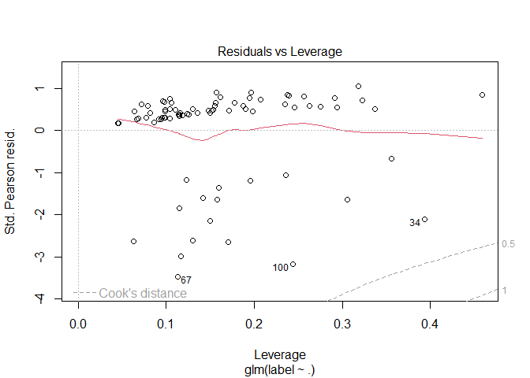<!-- --><!-- -->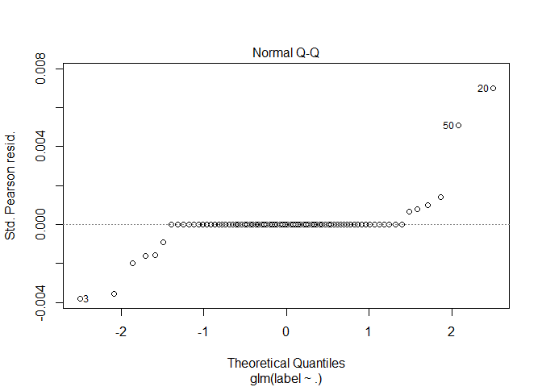<!-- --><!-- -->

    ## Warning in sqrt(crit * p * (1 - hh)/hh): NaNs produced

    ## Warning in sqrt(crit * p * (1 - hh)/hh): NaNs produced

    ## Warning in confusionMatrix.default(y_hat_knn_test, factor(test$label)): Levels
    ## are not in the same order for reference and data. Refactoring data to match.

    ## Warning in confusionMatrix.default(y_hat_knn_test, factor(test$label)): Levels
    ## are not in the same order for reference and data. Refactoring data to match.

    ## Warning in confusionMatrix.default(y_hat_knn_test, factor(test$label)): Levels
    ## are not in the same order for reference and data. Refactoring data to match.

    ## Warning in confusionMatrix.default(y_hat_knn_test, factor(test$label)): Levels
    ## are not in the same order for reference and data. Refactoring data to match.

    ## Warning in confusionMatrix.default(y_hat_knn_test, factor(test$label)): Levels
    ## are not in the same order for reference and data. Refactoring data to match.

    ## Warning in confusionMatrix.default(y_hat_knn_test, factor(test$label)): Levels
    ## are not in the same order for reference and data. Refactoring data to match.

    ## Warning in confusionMatrix.default(y_hat_knn_test, factor(test$label)): Levels
    ## are not in the same order for reference and data. Refactoring data to match.

    ## Warning in confusionMatrix.default(y_hat_knn_test, factor(test$label)): Levels
    ## are not in the same order for reference and data. Refactoring data to match.

    ## Warning in confusionMatrix.default(y_hat_knn_test, factor(test$label)): Levels
    ## are not in the same order for reference and data. Refactoring data to match.

    ## Warning in confusionMatrix.default(y_hat_knn_test, factor(test$label)): Levels
    ## are not in the same order for reference and data. Refactoring data to match.

    ## Warning in confusionMatrix.default(y_hat_knn_test, factor(test$label)): Levels
    ## are not in the same order for reference and data. Refactoring data to match.

    ## Warning in confusionMatrix.default(y_hat_knn_test, factor(test$label)): Levels
    ## are not in the same order for reference and data. Refactoring data to match.

    ## Warning in confusionMatrix.default(y_hat_knn_test, factor(test$label)): Levels
    ## are not in the same order for reference and data. Refactoring data to match.

    ## Warning in confusionMatrix.default(y_hat_knn_test, factor(test$label)): Levels
    ## are not in the same order for reference and data. Refactoring data to match.

    ## Warning in confusionMatrix.default(y_hat_knn_test, factor(test$label)): Levels
    ## are not in the same order for reference and data. Refactoring data to match.

    ## Warning in confusionMatrix.default(y_hat_knn_test, factor(test$label)): Levels
    ## are not in the same order for reference and data. Refactoring data to match.

    ## Warning in confusionMatrix.default(y_hat_knn_train, factor(train$label)): Levels
    ## are not in the same order for reference and data. Refactoring data to match.

    ## Warning in confusionMatrix.default(y_hat_knn_test, factor(test$label)): Levels
    ## are not in the same order for reference and data. Refactoring data to match.

    ## Warning in confusionMatrix.default(y_hat_knn_train, factor(train$label)): Levels
    ## are not in the same order for reference and data. Refactoring data to match.

    ## Warning in confusionMatrix.default(y_hat_knn_test, factor(test$label)): Levels
    ## are not in the same order for reference and data. Refactoring data to match.

    ## Warning in confusionMatrix.default(y_hat_knn_train, factor(train$label)): Levels
    ## are not in the same order for reference and data. Refactoring data to match.

    ## Warning in confusionMatrix.default(y_hat_knn_test, factor(test$label)): Levels
    ## are not in the same order for reference and data. Refactoring data to match.

    ## Warning in confusionMatrix.default(y_hat_knn_train, factor(train$label)): Levels
    ## are not in the same order for reference and data. Refactoring data to match.

    ## Warning in confusionMatrix.default(y_hat_knn_test, factor(test$label)): Levels
    ## are not in the same order for reference and data. Refactoring data to match.

    ## Warning in confusionMatrix.default(y_hat_knn_train, factor(train$label)): Levels
    ## are not in the same order for reference and data. Refactoring data to match.

    ## Warning in confusionMatrix.default(y_hat_knn_test, factor(test$label)): Levels
    ## are not in the same order for reference and data. Refactoring data to match.

    ## Warning in confusionMatrix.default(y_hat_knn_train, factor(train$label)): Levels
    ## are not in the same order for reference and data. Refactoring data to match.

    ## Warning in confusionMatrix.default(y_hat_knn_test, factor(test$label)): Levels
    ## are not in the same order for reference and data. Refactoring data to match.

    ## Warning in confusionMatrix.default(y_hat_knn_train, factor(train$label)): Levels
    ## are not in the same order for reference and data. Refactoring data to match.

    ## Warning in confusionMatrix.default(y_hat_knn_test, factor(test$label)): Levels
    ## are not in the same order for reference and data. Refactoring data to match.

    ## Warning in confusionMatrix.default(y_hat_knn_train, factor(train$label)): Levels
    ## are not in the same order for reference and data. Refactoring data to match.

    ## Warning in confusionMatrix.default(y_hat_knn_test, factor(test$label)): Levels
    ## are not in the same order for reference and data. Refactoring data to match.

    ## Warning in confusionMatrix.default(y_hat_knn_train, factor(train$label)): Levels
    ## are not in the same order for reference and data. Refactoring data to match.

    ## Warning in confusionMatrix.default(y_hat_knn_test, factor(test$label)): Levels
    ## are not in the same order for reference and data. Refactoring data to match.

    ## Warning in confusionMatrix.default(y_hat_knn_train, factor(train$label)): Levels
    ## are not in the same order for reference and data. Refactoring data to match.

    ## Warning in confusionMatrix.default(y_hat_knn_test, factor(test$label)): Levels
    ## are not in the same order for reference and data. Refactoring data to match.

    ## Warning in confusionMatrix.default(y_hat_knn_train, factor(train$label)): Levels
    ## are not in the same order for reference and data. Refactoring data to match.

    ## Warning in confusionMatrix.default(y_hat_knn_test, factor(test$label)): Levels
    ## are not in the same order for reference and data. Refactoring data to match.

    ## Warning in confusionMatrix.default(y_hat_knn_train, factor(train$label)): Levels
    ## are not in the same order for reference and data. Refactoring data to match.

    ## Warning in confusionMatrix.default(y_hat_knn_test, factor(test$label)): Levels
    ## are not in the same order for reference and data. Refactoring data to match.

    ## [1] "depression"

    ## Warning: glm.fit: fitted probabilities numerically 0 or 1 occurred

<!-- --><!-- --><!-- --><!-- -->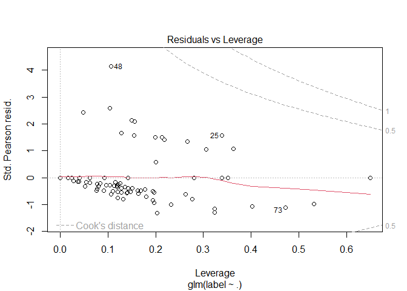<!-- -->

    ## [1] "anxiety"

<!-- -->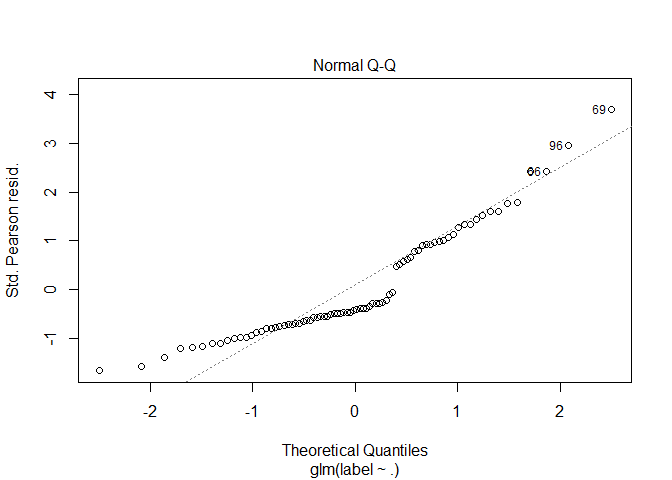<!-- --><!-- -->

    ## Warning in confusionMatrix.default(y_hat_knn_test, factor(test$label)): Levels
    ## are not in the same order for reference and data. Refactoring data to match.

    ## Warning in confusionMatrix.default(y_hat_knn_test, factor(test$label)): Levels
    ## are not in the same order for reference and data. Refactoring data to match.

    ## Warning in confusionMatrix.default(y_hat_knn_test, factor(test$label)): Levels
    ## are not in the same order for reference and data. Refactoring data to match.

    ## Warning in confusionMatrix.default(y_hat_knn_test, factor(test$label)): Levels
    ## are not in the same order for reference and data. Refactoring data to match.

<!-- -->

    ## [1] "panic_attack"

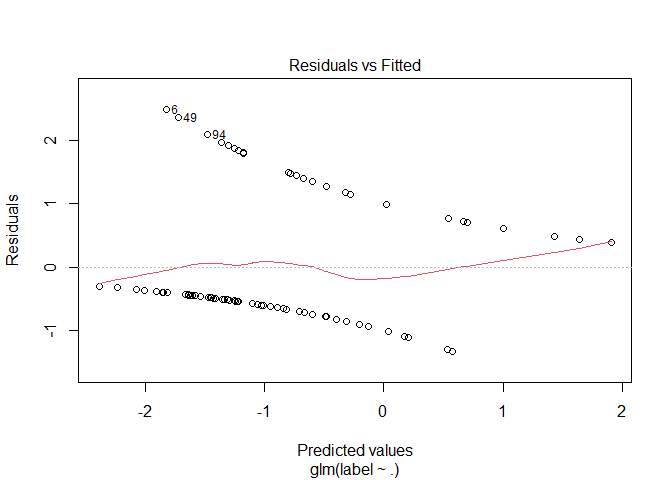<!-- -->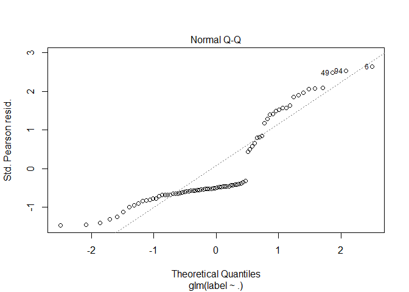<!-- --><!-- -->

    ## Warning in confusionMatrix.default(y_hat_knn_test, factor(test$label)): Levels
    ## are not in the same order for reference and data. Refactoring data to match.

    ## Warning in confusionMatrix.default(y_hat_knn_test, factor(test$label)): Levels
    ## are not in the same order for reference and data. Refactoring data to match.

    ## Warning in confusionMatrix.default(y_hat_knn_test, factor(test$label)): Levels
    ## are not in the same order for reference and data. Refactoring data to match.

    ## Warning in confusionMatrix.default(y_hat_knn_test, factor(test$label)): Levels
    ## are not in the same order for reference and data. Refactoring data to match.

    ## Warning in confusionMatrix.default(y_hat_knn_test, factor(test$label)): Levels
    ## are not in the same order for reference and data. Refactoring data to match.

    ## Warning in confusionMatrix.default(y_hat_knn_test, factor(test$label)): Levels
    ## are not in the same order for reference and data. Refactoring data to match.

    ## Warning in confusionMatrix.default(y_hat_knn_test, factor(test$label)): Levels
    ## are not in the same order for reference and data. Refactoring data to match.

    ## Warning in confusionMatrix.default(y_hat_knn_test, factor(test$label)): Levels
    ## are not in the same order for reference and data. Refactoring data to match.

    ## Warning in confusionMatrix.default(y_hat_knn_test, factor(test$label)): Levels
    ## are not in the same order for reference and data. Refactoring data to match.

    ## Warning in confusionMatrix.default(y_hat_knn_test, factor(test$label)): Levels
    ## are not in the same order for reference and data. Refactoring data to match.

    ## Warning in confusionMatrix.default(y_hat_knn_test, factor(test$label)): Levels
    ## are not in the same order for reference and data. Refactoring data to match.

    ## Warning in confusionMatrix.default(y_hat_knn_test, factor(test$label)): Levels
    ## are not in the same order for reference and data. Refactoring data to match.

    ## Warning in confusionMatrix.default(y_hat_knn_test, factor(test$label)): Levels
    ## are not in the same order for reference and data. Refactoring data to match.

    ## Warning in confusionMatrix.default(y_hat_knn_test, factor(test$label)): Levels
    ## are not in the same order for reference and data. Refactoring data to match.

    ## Warning in confusionMatrix.default(y_hat_knn_test, factor(test$label)): Levels
    ## are not in the same order for reference and data. Refactoring data to match.

    ## Warning in confusionMatrix.default(y_hat_knn_test, factor(test$label)): Levels
    ## are not in the same order for reference and data. Refactoring data to match.

    ## Warning in confusionMatrix.default(y_hat_knn_train, factor(train$label)): Levels
    ## are not in the same order for reference and data. Refactoring data to match.

    ## Warning in confusionMatrix.default(y_hat_knn_test, factor(test$label)): Levels
    ## are not in the same order for reference and data. Refactoring data to match.

    ## Warning in confusionMatrix.default(y_hat_knn_train, factor(train$label)): Levels
    ## are not in the same order for reference and data. Refactoring data to match.

    ## Warning in confusionMatrix.default(y_hat_knn_test, factor(test$label)): Levels
    ## are not in the same order for reference and data. Refactoring data to match.

    ## Warning in confusionMatrix.default(y_hat_knn_test, factor(test$label)): Levels
    ## are not in the same order for reference and data. Refactoring data to match.

    ## Warning in confusionMatrix.default(y_hat_knn_test, factor(test$label)): Levels
    ## are not in the same order for reference and data. Refactoring data to match.

    ## Warning in confusionMatrix.default(y_hat_knn_train, factor(train$label)): Levels
    ## are not in the same order for reference and data. Refactoring data to match.

    ## Warning in confusionMatrix.default(y_hat_knn_test, factor(test$label)): Levels
    ## are not in the same order for reference and data. Refactoring data to match.

    ## Warning in confusionMatrix.default(y_hat_knn_train, factor(train$label)): Levels
    ## are not in the same order for reference and data. Refactoring data to match.

    ## Warning in confusionMatrix.default(y_hat_knn_test, factor(test$label)): Levels
    ## are not in the same order for reference and data. Refactoring data to match.

    ## Warning in confusionMatrix.default(y_hat_knn_train, factor(train$label)): Levels
    ## are not in the same order for reference and data. Refactoring data to match.

    ## Warning in confusionMatrix.default(y_hat_knn_test, factor(test$label)): Levels
    ## are not in the same order for reference and data. Refactoring data to match.

    ## Warning in confusionMatrix.default(y_hat_knn_train, factor(train$label)): Levels
    ## are not in the same order for reference and data. Refactoring data to match.

    ## Warning in confusionMatrix.default(y_hat_knn_test, factor(test$label)): Levels
    ## are not in the same order for reference and data. Refactoring data to match.

<!-- -->

    ## [1] "engineering"

<!-- -->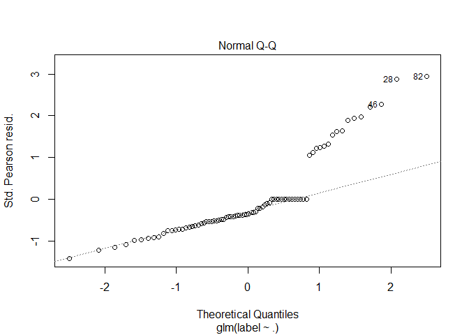<!-- -->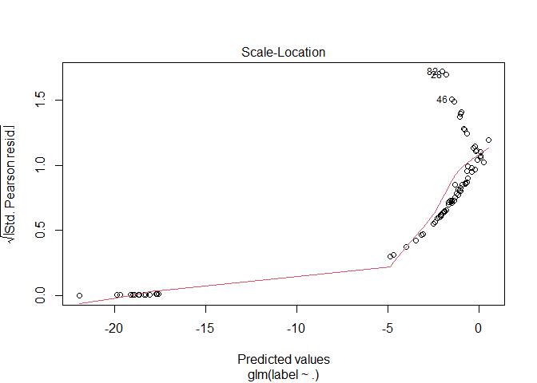<!-- -->

    ## Warning in confusionMatrix.default(y_hat_knn_test, factor(test$label)): Levels
    ## are not in the same order for reference and data. Refactoring data to match.

    ## Warning in confusionMatrix.default(y_hat_knn_test, factor(test$label)): Levels
    ## are not in the same order for reference and data. Refactoring data to match.

    ## Warning in confusionMatrix.default(y_hat_knn_test, factor(test$label)): Levels
    ## are not in the same order for reference and data. Refactoring data to match.

    ## Warning in confusionMatrix.default(y_hat_knn_test, factor(test$label)): Levels
    ## are not in the same order for reference and data. Refactoring data to match.

    ## Warning in confusionMatrix.default(y_hat_knn_train, factor(train$label)): Levels
    ## are not in the same order for reference and data. Refactoring data to match.

    ## Warning in confusionMatrix.default(y_hat_knn_test, factor(test$label)): Levels
    ## are not in the same order for reference and data. Refactoring data to match.

    ## Warning in confusionMatrix.default(y_hat_knn_train, factor(train$label)): Levels
    ## are not in the same order for reference and data. Refactoring data to match.

    ## Warning in confusionMatrix.default(y_hat_knn_test, factor(test$label)): Levels
    ## are not in the same order for reference and data. Refactoring data to match.

    ## Warning in confusionMatrix.default(y_hat_knn_train, factor(train$label)): Levels
    ## are not in the same order for reference and data. Refactoring data to match.

    ## Warning in confusionMatrix.default(y_hat_knn_test, factor(test$label)): Levels
    ## are not in the same order for reference and data. Refactoring data to match.

    ## Warning in confusionMatrix.default(y_hat_knn_train, factor(train$label)): Levels
    ## are not in the same order for reference and data. Refactoring data to match.

    ## Warning in confusionMatrix.default(y_hat_knn_test, factor(test$label)): Levels
    ## are not in the same order for reference and data. Refactoring data to match.

    ## Warning in confusionMatrix.default(y_hat_knn_train, factor(train$label)): Levels
    ## are not in the same order for reference and data. Refactoring data to match.

    ## Warning in confusionMatrix.default(y_hat_knn_test, factor(test$label)): Levels
    ## are not in the same order for reference and data. Refactoring data to match.

    ## Warning in confusionMatrix.default(y_hat_knn_train, factor(train$label)): Levels
    ## are not in the same order for reference and data. Refactoring data to match.

    ## Warning in confusionMatrix.default(y_hat_knn_test, factor(test$label)): Levels
    ## are not in the same order for reference and data. Refactoring data to match.

    ## Warning in confusionMatrix.default(y_hat_knn_train, factor(train$label)): Levels
    ## are not in the same order for reference and data. Refactoring data to match.

    ## Warning in confusionMatrix.default(y_hat_knn_test, factor(test$label)): Levels
    ## are not in the same order for reference and data. Refactoring data to match.

    ## Warning in confusionMatrix.default(y_hat_knn_train, factor(train$label)): Levels
    ## are not in the same order for reference and data. Refactoring data to match.

    ## Warning in confusionMatrix.default(y_hat_knn_test, factor(test$label)): Levels
    ## are not in the same order for reference and data. Refactoring data to match.

    ## Warning in confusionMatrix.default(y_hat_knn_train, factor(train$label)): Levels
    ## are not in the same order for reference and data. Refactoring data to match.

    ## Warning in confusionMatrix.default(y_hat_knn_test, factor(test$label)): Levels
    ## are not in the same order for reference and data. Refactoring data to match.

    ## Warning in confusionMatrix.default(y_hat_knn_train, factor(train$label)): Levels
    ## are not in the same order for reference and data. Refactoring data to match.

    ## Warning in confusionMatrix.default(y_hat_knn_test, factor(test$label)): Levels
    ## are not in the same order for reference and data. Refactoring data to match.

    ## Warning in confusionMatrix.default(y_hat_knn_train, factor(train$label)): Levels
    ## are not in the same order for reference and data. Refactoring data to match.

    ## Warning in confusionMatrix.default(y_hat_knn_test, factor(test$label)): Levels
    ## are not in the same order for reference and data. Refactoring data to match.

    ## Warning in confusionMatrix.default(y_hat_knn_train, factor(train$label)): Levels
    ## are not in the same order for reference and data. Refactoring data to match.

    ## Warning in confusionMatrix.default(y_hat_knn_test, factor(test$label)): Levels
    ## are not in the same order for reference and data. Refactoring data to match.

    ## Warning in confusionMatrix.default(y_hat_knn_train, factor(train$label)): Levels
    ## are not in the same order for reference and data. Refactoring data to match.

    ## Warning in confusionMatrix.default(y_hat_knn_test, factor(test$label)): Levels
    ## are not in the same order for reference and data. Refactoring data to match.

    ## Warning in confusionMatrix.default(y_hat_knn_train, factor(train$label)): Levels
    ## are not in the same order for reference and data. Refactoring data to match.

    ## Warning in confusionMatrix.default(y_hat_knn_test, factor(test$label)): Levels
    ## are not in the same order for reference and data. Refactoring data to match.

    ## Warning in confusionMatrix.default(y_hat_knn_train, factor(train$label)): Levels
    ## are not in the same order for reference and data. Refactoring data to match.

    ## Warning in confusionMatrix.default(y_hat_knn_test, factor(test$label)): Levels
    ## are not in the same order for reference and data. Refactoring data to match.

    ## Warning in confusionMatrix.default(y_hat_knn_train, factor(train$label)): Levels
    ## are not in the same order for reference and data. Refactoring data to match.

    ## Warning in confusionMatrix.default(y_hat_knn_test, factor(test$label)): Levels
    ## are not in the same order for reference and data. Refactoring data to match.

<!-- -->

    ## [1] "bcs"

<!-- --><!-- -->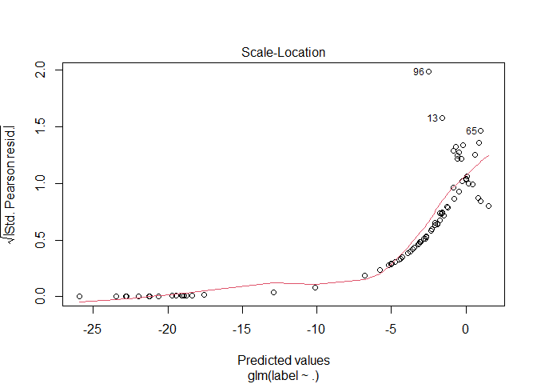<!-- -->

    ## Warning in confusionMatrix.default(y_hat_knn_test, factor(test$label)): Levels
    ## are not in the same order for reference and data. Refactoring data to match.

    ## Warning in confusionMatrix.default(y_hat_knn_test, factor(test$label)): Levels
    ## are not in the same order for reference and data. Refactoring data to match.

    ## Warning in confusionMatrix.default(y_hat_knn_test, factor(test$label)): Levels
    ## are not in the same order for reference and data. Refactoring data to match.

    ## Warning in confusionMatrix.default(y_hat_knn_test, factor(test$label)): Levels
    ## are not in the same order for reference and data. Refactoring data to match.

    ## Warning in confusionMatrix.default(y_hat_knn_train, factor(train$label)): Levels
    ## are not in the same order for reference and data. Refactoring data to match.

    ## Warning in confusionMatrix.default(y_hat_knn_test, factor(test$label)): Levels
    ## are not in the same order for reference and data. Refactoring data to match.

    ## Warning in confusionMatrix.default(y_hat_knn_train, factor(train$label)): Levels
    ## are not in the same order for reference and data. Refactoring data to match.

    ## Warning in confusionMatrix.default(y_hat_knn_test, factor(test$label)): Levels
    ## are not in the same order for reference and data. Refactoring data to match.

    ## Warning in confusionMatrix.default(y_hat_knn_test, factor(test$label)): Levels
    ## are not in the same order for reference and data. Refactoring data to match.

    ## Warning in confusionMatrix.default(y_hat_knn_test, factor(test$label)): Levels
    ## are not in the same order for reference and data. Refactoring data to match.

    ## Warning in confusionMatrix.default(y_hat_knn_test, factor(test$label)): Levels
    ## are not in the same order for reference and data. Refactoring data to match.

    ## Warning in confusionMatrix.default(y_hat_knn_test, factor(test$label)): Levels
    ## are not in the same order for reference and data. Refactoring data to match.

    ## Warning in confusionMatrix.default(y_hat_knn_test, factor(test$label)): Levels
    ## are not in the same order for reference and data. Refactoring data to match.

    ## Warning in confusionMatrix.default(y_hat_knn_test, factor(test$label)): Levels
    ## are not in the same order for reference and data. Refactoring data to match.

    ## Warning in confusionMatrix.default(y_hat_knn_train, factor(train$label)): Levels
    ## are not in the same order for reference and data. Refactoring data to match.

    ## Warning in confusionMatrix.default(y_hat_knn_test, factor(test$label)): Levels
    ## are not in the same order for reference and data. Refactoring data to match.

    ## Warning in confusionMatrix.default(y_hat_knn_train, factor(train$label)): Levels
    ## are not in the same order for reference and data. Refactoring data to match.

    ## Warning in confusionMatrix.default(y_hat_knn_test, factor(test$label)): Levels
    ## are not in the same order for reference and data. Refactoring data to match.

    ## Warning in confusionMatrix.default(y_hat_knn_train, factor(train$label)): Levels
    ## are not in the same order for reference and data. Refactoring data to match.

    ## Warning in confusionMatrix.default(y_hat_knn_test, factor(test$label)): Levels
    ## are not in the same order for reference and data. Refactoring data to match.

    ## Warning in confusionMatrix.default(y_hat_knn_train, factor(train$label)): Levels
    ## are not in the same order for reference and data. Refactoring data to match.

    ## Warning in confusionMatrix.default(y_hat_knn_test, factor(test$label)): Levels
    ## are not in the same order for reference and data. Refactoring data to match.

    ## Warning in confusionMatrix.default(y_hat_knn_train, factor(train$label)): Levels
    ## are not in the same order for reference and data. Refactoring data to match.

    ## Warning in confusionMatrix.default(y_hat_knn_test, factor(test$label)): Levels
    ## are not in the same order for reference and data. Refactoring data to match.

    ## Warning in confusionMatrix.default(y_hat_knn_train, factor(train$label)): Levels
    ## are not in the same order for reference and data. Refactoring data to match.

    ## Warning in confusionMatrix.default(y_hat_knn_test, factor(test$label)): Levels
    ## are not in the same order for reference and data. Refactoring data to match.

    ## Warning in confusionMatrix.default(y_hat_knn_train, factor(train$label)): Levels
    ## are not in the same order for reference and data. Refactoring data to match.

    ## Warning in confusionMatrix.default(y_hat_knn_test, factor(test$label)): Levels
    ## are not in the same order for reference and data. Refactoring data to match.

    ## Warning in confusionMatrix.default(y_hat_knn_train, factor(train$label)): Levels
    ## are not in the same order for reference and data. Refactoring data to match.

    ## Warning in confusionMatrix.default(y_hat_knn_test, factor(test$label)): Levels
    ## are not in the same order for reference and data. Refactoring data to match.

<!-- -->

``` r
knn_dataframe <- data.frame(ks,train_accuracy,test_accuracy,binary_labels)
```

``` r
ggplot(knn_dataframe, aes(x=ks)) +
  geom_line(aes(y = train_accuracy), color = "red") + 
  geom_line(aes(y = test_accuracy), color = "blue") +
  facet_wrap(~binary_labels)
```

<!-- -->

``` r
value <- c("Depression","Anxiety","Panic Attack","Gender","Married","BCS","Engineering")
accuracy <- c()
pvs <- c()
sensitivity <- c()
specificity <- c()
baccuracy <- c()
```

Depression

``` r
knn_fit <- knn3(depression~., data=train, k=7) 
p_hat_knn_train <- predict(knn_fit, train, type="prob")
y_hat_knn_train <- factor(ifelse(p_hat_knn_train[,2]>0.5,1,0))
cm_train <- confusionMatrix(y_hat_knn_train, factor(train$depression))

p_hat_knn_test <- predict(knn_fit, test, type="prob")
y_hat_knn_test <- factor(ifelse(p_hat_knn_test[,2]>0.5,1,0))
cm <- confusionMatrix(y_hat_knn_test, factor(test$depression))
cm
```

    ## Confusion Matrix and Statistics
    ## 
    ##           Reference
    ## Prediction  0  1
    ##          0 12  5
    ##          1  2  1
    ##                                           
    ##                Accuracy : 0.65            
    ##                  95% CI : (0.4078, 0.8461)
    ##     No Information Rate : 0.7             
    ##     P-Value [Acc > NIR] : 0.7723          
    ##                                           
    ##                   Kappa : 0.0278          
    ##                                           
    ##  Mcnemar's Test P-Value : 0.4497          
    ##                                           
    ##             Sensitivity : 0.8571          
    ##             Specificity : 0.1667          
    ##          Pos Pred Value : 0.7059          
    ##          Neg Pred Value : 0.3333          
    ##              Prevalence : 0.7000          
    ##          Detection Rate : 0.6000          
    ##    Detection Prevalence : 0.8500          
    ##       Balanced Accuracy : 0.5119          
    ##                                           
    ##        'Positive' Class : 0               
    ## 

``` r
accuracy <- c(accuracy,cm$overall[1] )
pvs <- c(pvs,cm$overall[6])
sensitivity <- c(sensitivity,cm$byClass[1])
specificity <- c(specificity,cm$byClass[2])
baccuracy <- c(baccuracy,cm$byClass[11])
```

Anxiety

``` r
knn_fit <- knn3(anxiety~., data=train, k=2) 
p_hat_knn_train <- predict(knn_fit, train, type="prob")
y_hat_knn_train <- factor(ifelse(p_hat_knn_train[,2]>0.5,1,0))
cm_train <- confusionMatrix(y_hat_knn_train, factor(train$anxiety))

p_hat_knn_test <- predict(knn_fit, test, type="prob")
y_hat_knn_test <- factor(ifelse(p_hat_knn_test[,2]>0.5,1,0))
cm <- confusionMatrix(y_hat_knn_test, factor(test$anxiety))
```

``` r
accuracy <- c(accuracy,cm$overall[1] )
pvs <- c(pvs,cm$overall[6])
sensitivity <- c(sensitivity,cm$byClass[1])
specificity <- c(specificity,cm$byClass[2])
baccuracy <- c(baccuracy,cm$byClass[11])
```

Panic Attack

``` r
knn_fit <- knn3(panic_attack~., data=train, k=5) 
p_hat_knn_train <- predict(knn_fit, train, type="prob")
y_hat_knn_train <- factor(ifelse(p_hat_knn_train[,2]>0.5,1,0))
cm_train <- confusionMatrix(y_hat_knn_train, factor(train$panic_attack))

p_hat_knn_test <- predict(knn_fit, test, type="prob")
y_hat_knn_test <- factor(ifelse(p_hat_knn_test[,2]>0.5,1,0))
cm <- confusionMatrix(y_hat_knn_test, factor(test$panic_attack))
```

``` r
accuracy <- c(accuracy,cm$overall[1] )
pvs <- c(pvs,cm$overall[6])
sensitivity <- c(sensitivity,cm$byClass[1])
specificity <- c(specificity,cm$byClass[2])
baccuracy <- c(baccuracy,cm$byClass[11])
```

Treatment - not enough people in treatment so 0 people in the test set

``` r
knn_fit <- knn3(treatment~., data=train, k=k) 
p_hat_knn_train <- predict(knn_fit, train, type="prob")
y_hat_knn_train <- factor(ifelse(p_hat_knn_train[,2]>0.5,1,0))
cm_train <- confusionMatrix(y_hat_knn_train, factor(train$treatment))
```

    ## Warning in confusionMatrix.default(y_hat_knn_train, factor(train$treatment)):
    ## Levels are not in the same order for reference and data. Refactoring data to
    ## match.

``` r
p_hat_knn_test <- predict(knn_fit, test, type="prob")
y_hat_knn_test <- factor(ifelse(p_hat_knn_test[,2]>0.5,1,0))
#cm <- confusionMatrix(y_hat_knn_test, factor(test$treatment))
```

Gender

``` r
knn_fit <- knn3(gender~., data=train, k=9) 
p_hat_knn_train <- predict(knn_fit, train, type="prob")
y_hat_knn_train <- factor(ifelse(p_hat_knn_train[,2]>0.5,1,0))
cm_train <- confusionMatrix(y_hat_knn_train, factor(train$gender))

p_hat_knn_test <- predict(knn_fit, test, type="prob")
y_hat_knn_test <- factor(ifelse(p_hat_knn_test[,2]>0.5,1,0))
cm <- confusionMatrix(y_hat_knn_test, factor(test$gender))
```

    ## Warning in confusionMatrix.default(y_hat_knn_test, factor(test$gender)): Levels
    ## are not in the same order for reference and data. Refactoring data to match.

``` r
accuracy <- c(accuracy,cm$overall[1] )
pvs <- c(pvs,cm$overall[6])
sensitivity <- c(sensitivity,cm$byClass[1])
specificity <- c(specificity,cm$byClass[2])
baccuracy <- c(baccuracy,cm$byClass[11])
```

Married

``` r
knn_fit <- knn3(married~., data=train, k=3) 
p_hat_knn_train <- predict(knn_fit, train, type="prob")
y_hat_knn_train <- factor(ifelse(p_hat_knn_train[,2]>0.5,1,0))
cm_train <- confusionMatrix(y_hat_knn_train, factor(train$married))

p_hat_knn_test <- predict(knn_fit, test, type="prob")
y_hat_knn_test <- factor(ifelse(p_hat_knn_test[,2]>0.5,1,0))
cm <- confusionMatrix(y_hat_knn_test, factor(test$married))
```

    ## Warning in confusionMatrix.default(y_hat_knn_test, factor(test$married)): Levels
    ## are not in the same order for reference and data. Refactoring data to match.

``` r
accuracy <- c(accuracy,cm$overall[1] )
pvs <- c(pvs,cm$overall[6])
sensitivity <- c(sensitivity,cm$byClass[1])
specificity <- c(specificity,cm$byClass[2])
baccuracy <- c(baccuracy,cm$byClass[11])
```

BCS

``` r
knn_fit <- knn3(bcs~., data=train, k=4) 
p_hat_knn_train <- predict(knn_fit, train, type="prob")
y_hat_knn_train <- factor(ifelse(p_hat_knn_train[,2]>0.5,1,0))
cm_train <- confusionMatrix(y_hat_knn_train, factor(train$bcs))

p_hat_knn_test <- predict(knn_fit, test, type="prob")
y_hat_knn_test <- factor(ifelse(p_hat_knn_test[,2]>0.5,1,0))
cm <- confusionMatrix(y_hat_knn_test, factor(test$bcs))
```

``` r
accuracy <- c(accuracy,cm$overall[1] )
pvs <- c(pvs,cm$overall[6])
sensitivity <- c(sensitivity,cm$byClass[1])
specificity <- c(specificity,cm$byClass[2])
baccuracy <- c(baccuracy,cm$byClass[11])
```

Engineering

``` r
knn_fit <- knn3(engineering~., data=train, k=9) 
p_hat_knn_train <- predict(knn_fit, train, type="prob")
y_hat_knn_train <- factor(ifelse(p_hat_knn_train[,2]>0.5,1,0))
cm_train <- confusionMatrix(y_hat_knn_train, factor(train$engineering))
```

    ## Warning in confusionMatrix.default(y_hat_knn_train, factor(train$engineering)):
    ## Levels are not in the same order for reference and data. Refactoring data to
    ## match.

``` r
p_hat_knn_test <- predict(knn_fit, test, type="prob")
y_hat_knn_test <- factor(ifelse(p_hat_knn_test[,2]>0.5,1,0))
cm <- confusionMatrix(y_hat_knn_test, factor(test$engineering))
```

    ## Warning in confusionMatrix.default(y_hat_knn_test, factor(test$engineering)):
    ## Levels are not in the same order for reference and data. Refactoring data to
    ## match.

``` r
accuracy <- c(accuracy,cm$overall[1] )
pvs <- c(pvs,cm$overall[6])
sensitivity <- c(sensitivity,cm$byClass[1])
specificity <- c(specificity,cm$byClass[2])
baccuracy <- c(baccuracy,cm$byClass[11])
```

``` r
ks <- c(7,2,5,9,3,4,9)
data.frame(Variable=value, K=ks,Accuracy=accuracy, P_Value=pvs, Sensitivity=sensitivity, Specificity=specificity, Balance_Accuracy=baccuracy)
```

    ##       Variable K Accuracy   P_Value Sensitivity Specificity Balance_Accuracy
    ## 1   Depression 7     0.65 0.7722718   0.8571429   0.1666667        0.5119048
    ## 2      Anxiety 2     0.60 0.8866685   0.8571429   0.0000000        0.4285714
    ## 3 Panic Attack 5     0.50 0.8724788   0.8333333   0.0000000        0.4166667
    ## 4       Gender 9     0.60 0.5955987   0.0000000   1.0000000        0.5000000
    ## 5      Married 3     0.80 0.6296483   1.0000000   0.0000000        0.5000000
    ## 6          BCS 4     0.75 0.8042078   0.9375000   0.0000000        0.4687500
    ## 7  Engineering 9     0.80 0.6296483   1.0000000   0.0000000        0.5000000

Lasso Regression

Depression

``` r
eval_results <- function(true, predicted, df) {
  SSE <- sum((predicted - true)^2)
  SST <- sum((true - mean(true))^2)
  R_square <- 1 - SSE / SST
  RMSE = sqrt(SSE/nrow(df))

  
  # Model performance metrics
data.frame(
  RMSE = RMSE,
  Rsquare = R_square
)
  
}
```

``` r
dummies_train <- dummyVars(depression~ ., data = train)
dummies_test <- dummyVars(depression~ ., data = test)
train_dummies = predict(dummies_train, newdata = train)
test_dummies = predict(dummies_test, newdata = test)

x = as.matrix(train_dummies)
y_train = train$depression

x_test = as.matrix(test_dummies)
y_test = test$depression
```

``` r
lambdas <- 10^seq(2, -3, by = -.1)

# Setting alpha = 1 implements lasso regression
lasso_reg <- cv.glmnet(x, y_train, alpha = 1, lambda = lambdas, standardize = TRUE, nfolds = 10)

# Best 
lambda_best <- lasso_reg$lambda.min 
lambda_best
```

    ## [1] 0.05011872

``` r
plot(lasso_reg)
```

<!-- -->

want smaller RMSE

``` r
lasso_model <- glmnet(x, y_train, alpha = 1, lambda = lambda_best, standardize = TRUE)

predictions_train <- predict(lasso_model, s = lambda_best, newx = x)
eval_results(y_train, predictions_train, train)
```

    ##        RMSE   Rsquare
    ## 1 0.3840126 0.3618794

``` r
predictions_test <- predict(lasso_model, s = lambda_best, newx = x_test)
eval_results(y_test, predictions_test, test)
```

    ##        RMSE   Rsquare
    ## 1 0.3171511 0.5210246

``` r
lasso_model$beta
```

    ## 12 x 1 sparse Matrix of class "dgCMatrix"
    ##                       s0
    ## day           .         
    ## hour          .         
    ## age           .         
    ## grade        -0.02147255
    ## gpa           .         
    ## gender        .         
    ## married       0.54752979
    ## anxiety       0.09618754
    ## panic_attack  0.01430415
    ## treatment     0.16455691
    ## engineering   .         
    ## bcs           .

``` r
plot(lasso_model$beta)
```

<!-- -->

Anxiety

``` r
dummies_train <- dummyVars(anxiety~ ., data = train)
dummies_test <- dummyVars(anxiety~ ., data = test)
train_dummies = predict(dummies_train, newdata = train)
test_dummies = predict(dummies_test, newdata = test)

x = as.matrix(train_dummies)
y_train = train$anxiety

x_test = as.matrix(test_dummies)
y_test = test$anxiety
```

``` r
lambdas <- 10^seq(2, -3, by = -.1)

# Setting alpha = 1 implements lasso regression
lasso_reg <- cv.glmnet(x, y_train, alpha = 1, lambda = lambdas, standardize = TRUE, nfolds = 10)

# Best 
lambda_best <- lasso_reg$lambda.min 
lambda_best
```

    ## [1] 0.03981072

``` r
plot(lasso_reg)
```

<!-- -->

want smaller RMSE

``` r
lasso_model <- glmnet(x, y_train, alpha = 1, lambda = lambda_best, standardize = TRUE)

predictions_train <- predict(lasso_model, s = lambda_best, newx = x)
eval_results(y_train, predictions_train, train)
```

    ##        RMSE   Rsquare
    ## 1 0.4444798 0.1315942

``` r
predictions_test <- predict(lasso_model, s = lambda_best, newx = x_test)
eval_results(y_test, predictions_test, test)
```

    ##        RMSE    Rsquare
    ## 1 0.4486646 0.04142889

``` r
lasso_model$beta
```

    ## 12 x 1 sparse Matrix of class "dgCMatrix"
    ##                       s0
    ## day           .         
    ## hour         -0.01116385
    ## age           .         
    ## grade         .         
    ## gpa           0.12675740
    ## gender        .         
    ## married       .         
    ## depression    0.17691835
    ## panic_attack  .         
    ## treatment     .         
    ## engineering  -0.11145221
    ## bcs           .

``` r
plot(lasso_model$beta)
```

<!-- -->

Panic attack

``` r
dummies_train <- dummyVars(panic_attack~ ., data = train)
dummies_test <- dummyVars(panic_attack~ ., data = test)
train_dummies = predict(dummies_train, newdata = train)
test_dummies = predict(dummies_test, newdata = test)

x = as.matrix(train_dummies)
y_train = train$panic_attack

x_test = as.matrix(test_dummies)
y_test = test$panic_attack
```

``` r
lambdas <- 10^seq(2, -3, by = -.1)

# Setting alpha = 1 implements lasso regression
lasso_reg <- cv.glmnet(x, y_train, alpha = 1, lambda = lambdas, standardize = TRUE, nfolds = 10)

# Best 
lambda_best <- lasso_reg$lambda.min 
lambda_best
```

    ## [1] 100

``` r
plot(lasso_reg)
```

<!-- -->

want smaller RMSE

``` r
lasso_model <- glmnet(x, y_train, alpha = 1, lambda = lambda_best, standardize = TRUE)

predictions_train <- predict(lasso_model, s = lambda_best, newx = x)
eval_results(y_train, predictions_train, train)
```

    ##        RMSE Rsquare
    ## 1 0.4635124       0

``` r
predictions_test <- predict(lasso_model, s = lambda_best, newx = x_test)
eval_results(y_test, predictions_test, test)
```

    ##        RMSE     Rsquare
    ## 1 0.4976507 -0.03190104

``` r
lasso_model$beta
```

    ## 12 x 1 sparse Matrix of class "dgCMatrix"
    ##             s0
    ## day          0
    ## hour         .
    ## age          .
    ## grade        .
    ## gpa          .
    ## gender       .
    ## married      .
    ## depression   .
    ## anxiety      .
    ## treatment    .
    ## engineering  .
    ## bcs          .

``` r
plot(lasso_model$beta)
```

<!-- -->

Treatment

``` r
dummies_train <- dummyVars(treatment~ ., data = train)
dummies_test <- dummyVars(treatment~ ., data = test)
train_dummies = predict(dummies_train, newdata = train)
test_dummies = predict(dummies_test, newdata = test)

x = as.matrix(train_dummies)
y_train = train$treatment

x_test = as.matrix(test_dummies)
y_test = test$treatment
```

``` r
lambdas <- 10^seq(2, -3, by = -.1)

# Setting alpha = 1 implements lasso regression
lasso_reg <- cv.glmnet(x, y_train, alpha = 1, lambda = lambdas, standardize = TRUE, nfolds = 10)

# Best 
lambda_best <- lasso_reg$lambda.min 
lambda_best
```

    ## [1] 0.03981072

``` r
plot(lasso_reg)
```

<!-- -->

want smaller RMSE

``` r
lasso_model <- glmnet(x, y_train, alpha = 1, lambda = lambda_best, standardize = TRUE)

predictions_train <- predict(lasso_model, s = lambda_best, newx = x)
eval_results(y_train, predictions_train, train)
```

    ##        RMSE   Rsquare
    ## 1 0.2396408 0.1722133

``` r
predictions_test <- predict(lasso_model, s = lambda_best, newx = x_test)
eval_results(y_test, predictions_test, test)
```

    ##        RMSE Rsquare
    ## 1 0.1136082    -Inf

``` r
lasso_model$beta
```

    ## 12 x 1 sparse Matrix of class "dgCMatrix"
    ##                      s0
    ## day          .         
    ## hour         .         
    ## age          .         
    ## grade        .         
    ## gpa          .         
    ## gender       .         
    ## married      0.14409650
    ## depression   0.06445601
    ## anxiety      .         
    ## panic_attack .         
    ## engineering  .         
    ## bcs          .

``` r
plot(lasso_model$beta)
```

<!-- -->
